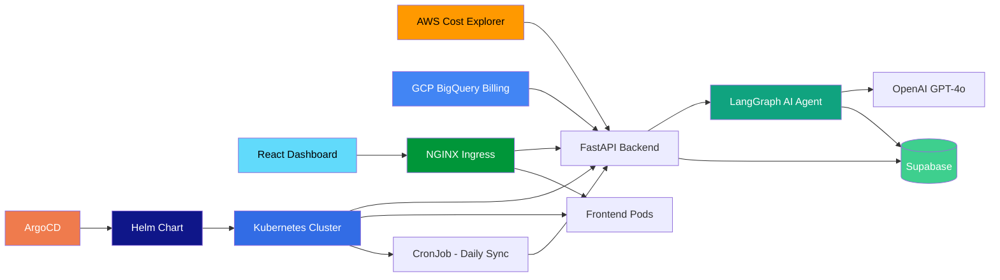

# Multi-Cloud Cost Optimizer with AI Recommendations

An AI-powered tool that analyzes AWS and GCP cloud spending, detects cost anomalies, and delivers actionable optimization recommendations with estimated savings -- all from a single dashboard.

## Architecture



## Features

- **Multi-cloud cost tracking** -- Unified view of AWS and GCP spending with daily, weekly, and monthly breakdowns
- **AI anomaly detection** -- LangGraph agent identifies unusual spend patterns and cost spikes automatically
- **Optimization recommendations** -- Actionable suggestions (rightsizing, RI/CUD, unused resources) with estimated monthly savings
- **Interactive charts** -- Recharts-powered dashboard with drill-down by service, account, and time range
- **Kubernetes-native deployment** -- Production-grade manifests with HPA, NetworkPolicies, and health probes
- **Helm-packaged releases** -- Single chart for backend, frontend, ingress, CronJob, and all supporting resources
- **GitOps with ArgoCD** -- ApplicationSet manages dev, staging, and production environments from a single definition
- **Automated daily cost sync** -- Kubernetes CronJob triggers the `/api/costs/sync` endpoint at 02:00 UTC every day

## Tech Stack

| Layer | Technology |
|-------|-----------|
| Frontend | React 18, TypeScript, Vite, Recharts, Tailwind CSS |
| Backend | Python 3.12, FastAPI, Pydantic |
| AI Agent | LangChain, LangGraph, OpenAI GPT-4o |
| Database | Supabase (PostgreSQL) |
| Cloud Data | AWS Cost Explorer (boto3), GCP BigQuery |
| Containers | Docker, GHCR |
| Orchestration | Kubernetes, NGINX Ingress, HPA, NetworkPolicy |
| Packaging | Helm 3 |
| GitOps | ArgoCD, ApplicationSet |
| Infrastructure | Terraform, Cloud Run, Secret Manager |
| CI/CD | GitHub Actions |

## Quick Start

### Prerequisites

- Docker and Docker Compose
- (Optional) OpenAI API key, AWS credentials, GCP project for live data

### 1. Clone and configure

```bash
git clone https://github.com/your-org/cloud-cost-optimizer.git
cd cloud-cost-optimizer
cp .env.example .env
# Edit .env with your keys, or leave DEMO_MODE=true for sample data
```

### 2. Start with Docker Compose

```bash
docker-compose up --build
```

- **Backend API:** http://localhost:8000
- **Frontend Dashboard:** http://localhost:3000
- **API Docs:** http://localhost:8000/docs

> **Demo mode** (`DEMO_MODE=true`) auto-generates realistic multi-cloud cost data so you can explore the dashboard without connecting real cloud accounts.

### 3. Deploy to GCP (optional)

```bash
cd terraform
cp terraform.tfvars.example terraform.tfvars
# Edit terraform.tfvars with your project details and secrets

terraform init
terraform plan
terraform apply
```

## Kubernetes Deployment

Raw manifests live in `k8s/` for quick cluster deployment without Helm.

```bash
kubectl apply -f k8s/namespace.yaml
kubectl apply -f k8s/backend/
kubectl apply -f k8s/frontend/
kubectl apply -f k8s/network-policy.yaml
kubectl apply -f k8s/ingress.yaml
```

Key resources:

| Resource | Description |
|----------|-------------|
| `namespace.yaml` | Dedicated `cost-optimizer` namespace |
| `backend/deployment.yaml` | Backend pods with liveness, readiness, and startup probes |
| `backend/hpa.yaml` | HPA scaling 2-8 replicas at 70% CPU with scale-down stabilization |
| `backend/cronjob.yaml` | Daily cost sync CronJob (02:00 UTC, `concurrencyPolicy: Forbid`) |
| `backend/configmap.yaml` | Non-secret environment variables |
| `backend/secret.yaml` | API keys and credentials (template -- populate before applying) |
| `frontend/deployment.yaml` | Frontend NGINX pods |
| `ingress.yaml` | NGINX Ingress with TLS via cert-manager and path-based routing (`/api` to backend, `/` to frontend) |
| `network-policy.yaml` | Least-privilege NetworkPolicies for both backend and frontend pods |

## Helm Chart

The `helm/cost-optimizer` chart packages every Kubernetes resource into a single installable unit.

### Install

```bash
helm install cost-optimizer ./helm/cost-optimizer \
  --namespace cost-optimizer \
  --create-namespace \
  -f helm/cost-optimizer/values.yaml
```

### Override per environment

```bash
# Development
helm upgrade cost-optimizer ./helm/cost-optimizer \
  --namespace cost-optimizer-dev \
  -f argocd/overlays/dev/values.yaml

# Production
helm upgrade cost-optimizer ./helm/cost-optimizer \
  --namespace cost-optimizer \
  -f argocd/overlays/prod/values.yaml
```

### Chart highlights

- **CronJob for daily cost sync** -- Runs `curl -X POST /api/costs/sync` at 02:00 UTC with retry logic (3 retries, 10s delay, 300s timeout). Disabled by default in dev; enabled in production.
- **HPA** -- Auto-scales backend from 2 to 8 replicas (production: 3 to 10) based on CPU utilization.
- **NetworkPolicy** -- Restricts backend ingress to frontend pods, the NGINX ingress controller, and CronJob pods only. Egress limited to DNS and HTTPS.
- **PodDisruptionBudget** -- Ensures minimum availability during voluntary disruptions.
- **External Secrets support** -- Set `backend.externalSecret.enabled: true` to pull secrets from an external provider (e.g., GCP Secret Manager via External Secrets Operator) instead of inline Kubernetes secrets.
- **ServiceAccount** -- Supports GKE Workload Identity via annotation (`iam.gke.io/gcp-service-account`).

### Key values

| Parameter | Default | Description |
|-----------|---------|-------------|
| `backend.replicaCount` | `2` | Backend pod replicas |
| `backend.autoscaling.enabled` | `true` | Enable HPA |
| `backend.autoscaling.maxReplicas` | `8` | Max backend replicas |
| `cronjob.enabled` | `true` | Enable daily cost sync |
| `cronjob.schedule` | `"0 2 * * *"` | Cron schedule (02:00 UTC) |
| `ingress.enabled` | `true` | Create Ingress resource |
| `ingress.host` | `cost-optimizer.example.com` | Ingress hostname |
| `networkPolicy.enabled` | `true` | Enforce NetworkPolicies |
| `podDisruptionBudget.enabled` | `true` | Create PDB |

## ArgoCD GitOps

ArgoCD manages all environments through a single `ApplicationSet`. Merging to a branch automatically deploys the corresponding environment.

### Multi-environment setup

| Environment | Branch | Namespace | Auto-sync | Prune |
|-------------|--------|-----------|-----------|-------|
| **dev** | `develop` | `cost-optimizer-dev` | Yes | Yes |
| **staging** | `staging` | `cost-optimizer-staging` | Yes | Yes |
| **prod** | `main` | `cost-optimizer` | No (manual) | No |

### Bootstrap ArgoCD resources

```bash
kubectl apply -f argocd/project.yaml
kubectl apply -f argocd/applicationset.yaml
```

The `ApplicationSet` (`argocd/applicationset.yaml`) generates one ArgoCD `Application` per environment. Each application points to the Helm chart at `helm/cost-optimizer` and overlays environment-specific values from `argocd/overlays/<env>/values.yaml`.

### Per-environment value overrides

- **`argocd/overlays/dev/values.yaml`** -- Single replica, GPT-3.5 Turbo, no CronJob, no NetworkPolicy, no PDB.
- **`argocd/overlays/staging/values.yaml`** -- Moderate resources, used for integration testing.
- **`argocd/overlays/prod/values.yaml`** -- 3+ replicas, GPT-4, HPA (3-10), pod anti-affinity, rate limiting on ingress, External Secrets Operator for credentials, GKE Workload Identity.

### Sync policies

- Dev and staging use automated sync with self-heal so that pushes deploy immediately and manual drift is corrected.
- Production requires a manual sync trigger in the ArgoCD UI or CLI, and pruning is disabled to prevent accidental resource deletion.
- All environments use server-side apply and retry with exponential backoff (5s to 3m, 5 attempts).

## Project Structure

```
cloud-cost-optimizer/
├── backend/
│   ├── app/
│   │   ├── agents/              # LangGraph AI agent definitions
│   │   ├── api/                 # FastAPI route handlers
│   │   ├── core/                # Config, settings, dependencies
│   │   ├── models/              # Pydantic schemas & DB models
│   │   └── services/            # AWS, GCP, Supabase integrations
│   ├── Dockerfile
│   └── requirements.txt
├── frontend/
│   ├── src/
│   │   ├── components/          # React UI components
│   │   ├── hooks/               # Custom React hooks
│   │   ├── pages/               # Dashboard pages
│   │   └── services/            # API client
│   ├── Dockerfile
│   └── package.json
├── k8s/                         # Raw Kubernetes manifests
│   ├── namespace.yaml
│   ├── ingress.yaml
│   ├── network-policy.yaml
│   ├── backend/
│   │   ├── deployment.yaml
│   │   ├── service.yaml
│   │   ├── configmap.yaml
│   │   ├── secret.yaml
│   │   ├── hpa.yaml
│   │   └── cronjob.yaml         # Daily cost sync (02:00 UTC)
│   └── frontend/
│       ├── deployment.yaml
│       └── service.yaml
├── helm/
│   └── cost-optimizer/
│       ├── Chart.yaml
│       ├── values.yaml           # Default values
│       └── templates/
│           ├── _helpers.tpl
│           ├── namespace.yaml
│           ├── backend-deployment.yaml
│           ├── backend-service.yaml
│           ├── backend-configmap.yaml
│           ├── backend-secret.yaml
│           ├── backend-hpa.yaml
│           ├── frontend-deployment.yaml
│           ├── frontend-service.yaml
│           ├── ingress.yaml
│           ├── cronjob.yaml      # Helm-templated daily sync
│           ├── network-policy.yaml
│           ├── serviceaccount.yaml
│           └── NOTES.txt
├── argocd/
│   ├── project.yaml              # ArgoCD AppProject with RBAC
│   ├── application.yaml          # Standalone prod Application
│   ├── applicationset.yaml       # Multi-env ApplicationSet
│   └── overlays/
│       ├── dev/values.yaml
│       ├── staging/values.yaml
│       └── prod/values.yaml
├── terraform/
│   ├── main.tf
│   ├── variables.tf
│   ├── outputs.tf
│   └── modules/
│       ├── apis/
│       ├── iam/
│       ├── secret-manager/
│       └── cloud-run/
├── .github/workflows/ci.yml
├── docker-compose.yml
├── .env.example
└── README.md
```

## License

MIT
