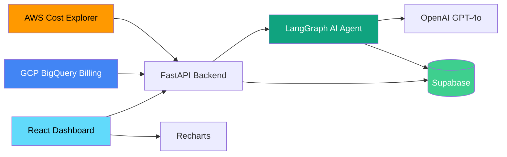

# Multi-Cloud Cost Optimizer with AI Recommendations

An AI-powered tool that analyzes AWS and GCP cloud spending, detects cost anomalies, and delivers actionable optimization recommendations with estimated savings -- all from a single dashboard.

## Architecture



## Features

- **Multi-cloud cost tracking** -- Unified view of AWS and GCP spending with daily, weekly, and monthly breakdowns
- **AI anomaly detection** -- LangGraph agent identifies unusual spend patterns and cost spikes automatically
- **Optimization recommendations** -- Actionable suggestions (rightsizing, RI/CUD, unused resources) with estimated monthly savings
- **Interactive charts** -- Recharts-powered dashboard with drill-down by service, account, and time range

## Tech Stack

| Layer | Technology |
|-------|-----------|
| Frontend | React 18, TypeScript, Vite, Recharts, Tailwind CSS |
| Backend | Python 3.12, FastAPI, Pydantic |
| AI Agent | LangChain, LangGraph, OpenAI GPT-4o |
| Database | Supabase (PostgreSQL) |
| Cloud Data | AWS Cost Explorer (boto3), GCP BigQuery |
| Infrastructure | Terraform, Cloud Run, Secret Manager |
| CI/CD | GitHub Actions, Docker |

## Quick Start

### Prerequisites

- Docker and Docker Compose
- (Optional) OpenAI API key, AWS credentials, GCP project for live data

### 1. Clone and configure

```bash
git clone https://github.com/your-org/cloud-cost-optimizer.git
cd cloud-cost-optimizer
cp .env.example .env
# Edit .env with your keys, or leave DEMO_MODE=true for sample data
```

### 2. Start with Docker Compose

```bash
docker-compose up --build
```

- **Backend API:** http://localhost:8000
- **Frontend Dashboard:** http://localhost:3000
- **API Docs:** http://localhost:8000/docs

> **Demo mode** (`DEMO_MODE=true`) auto-generates realistic multi-cloud cost data so you can explore the dashboard without connecting real cloud accounts.

### 3. Deploy to GCP (optional)

```bash
cd terraform
cp terraform.tfvars.example terraform.tfvars
# Edit terraform.tfvars with your project details and secrets

terraform init
terraform plan
terraform apply
```

## Project Structure

```
cloud-cost-optimizer/
├── backend/
│   ├── app/
│   │   ├── agents/          # LangGraph AI agent definitions
│   │   ├── api/             # FastAPI route handlers
│   │   ├── core/            # Config, settings, dependencies
│   │   ├── models/          # Pydantic schemas & DB models
│   │   └── services/        # AWS, GCP, Supabase integrations
│   ├── Dockerfile
│   └── requirements.txt
├── frontend/
│   ├── src/
│   │   ├── components/      # React UI components
│   │   ├── hooks/           # Custom React hooks
│   │   ├── pages/           # Dashboard pages
│   │   └── services/        # API client
│   ├── Dockerfile
│   └── package.json
├── terraform/
│   ├── main.tf              # Root module orchestration
│   ├── variables.tf
│   ├── outputs.tf
│   └── modules/
│       ├── apis/            # Enable required GCP APIs
│       ├── iam/             # Service account & roles
│       ├── secret-manager/  # Application secrets
│       └── cloud-run/       # Backend deployment
├── .github/workflows/ci.yml
├── docker-compose.yml
├── .env.example
└── README.md
```

## License

MIT
